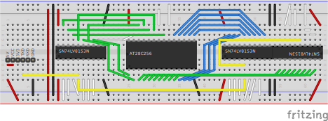
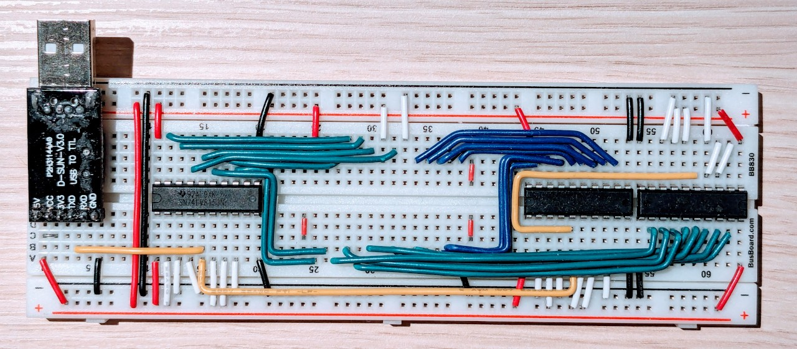

# Breadboard EEPROM Programmer

> A parallel EEPROM programmer built on a breadboard.

The **SN74LV8153** is a serial-to-parallel IC. It can translate serial (yes, UART) to 8 parallel
output pins. In combination with a USB-to-serial converter this is a very powerful, yet simple setup
to interact with breadboard circuitry from a computer. We're going to leverage that for building an
EEPROM programmer.

No soldering required. No building firmware. No micro controller. Just assemble the circuit on a
breadboard, connect USB, and you're good to go!


## Hardware

We use three individually addressable SN74LV8153 chips. The one on the left (address 1) is used for
the 7 upper address lines (green) and the write enable signal (white). The one on the right
(address 0) is used for the 8 lower address lines (green). The last one (address 2) is used for the
8 data lines (blue). The serial data line (yellow) connects the TX output of the USB-to-serial
adapter (left) to the RX input of all SN74LV8153. And that's it. Plug the EEPROM in the middle and
get to flashing.



Color Coding:
- 🔴 5V
- ⚫ GND
- 🟢 Address Lines
- 🔵 Data Lines
- ⚪ IC Control
- 🟡 Serial


Here is the finished breadboard:




## Software

Written in python using `pyserial`. [Source Code.](bbeeprog.py)


### Setup

```bash
git clone https://github.com/gschwaer/breadboard-eeprom-programmer.git
cd breadboard-eeprom-programmer
python3.9 -m venv .venv
source .venv/bin/activate
pip install --upgrade pip wheel
pip install -r requirements.txt
```
Note: Should work fine with all python versions >= 3.8.


### Usage

Initialize the programmer (do this before inserting the EEPROM!)
```bash
./bbeeprog.py init /dev/ttyUSB0
```

Flash data to the EEPROM
```bash
./bbeeprog.py flash /dev/ttyUSB0 ~/my_file.hex
```

Flash only the data that changed between `~/my_old_file.hex` and `~/my_new_file.hex` to the EEPROM
```bash
./bbeeprog.py flash /dev/ttyUSB0 --only-changes=~/my_old_file.hex ~/my_new_file.hex
```
Warning: Beware, if the provided "old" file is not identical to the content of the EEPROM, the
         result is undefined.

The `--only-changes` option is especially useful when combined with a build script or a Makefile.
The flashing target can copy the binary to a hidden file after flashing and then provide the last
flashed binary on every new flashing. Something like so:
```Makefile
.PHONY: flash
flash: out.hex
ifeq ($(wildcard ./.out.hex),)
	$(bbeeprog) flash $(device) $<
else
	$(bbeeprog) flash --only-changes=.out.hex $(device) $<
endif
	cp out.hex .out.hex
```

## Pros And Cons

The Pros:

- 🧑‍🏭 No soldering needed
  - Circuit works purely on breadboard!
- 💻 No need to build firmware or flash a micro controller
  - It's basically hardware bit-banging with USB as data source!
- 🛒 Low cost
  - 7.62 € for 3x SN74LV8153 (each 2.54 € at Mouser in Jan 2024), the rest is components that you
    probably have laying around (Breadboard, USB-to-serial, and some jumper wires)!
- ✨ Flexible
  - So much possibilities! Some ideas: Need more address lines? Slap another SN74LV8153 on the
    breadboard. Want accurate timing? Trigger a 555 timer. Really want data back? Operate a USART
    like the Intel 8251 via a SN74LV8153.
- ♻️ No waste
  - Don't need it anymore? Disassemble and reuse the parts for some other project!

The Cons:
- 🙉 No input capabilities
  - We cannot read back the EEPROM content, so we cannot validate it either.
- ✋ Not suited for all EEPROMs
  - Built for AT28C256. Others: write cycle timing cannot be too demanding
    ([more](#more-on-limitations)).
- 🔨 Increased memory wear
  - Because of timing restraints, we cannot use the better page-write mode
    ([more](#more-on-limitations)).
- 🐌 Slow
  - Not blazingly fast, but usable for smaller EEPROMs. 32kB works fine.


## Docs

- [SN74LV8153](https://www.ti.com/lit/ds/symlink/sn74lv8153.pdf?ts=1706468538401) -
  Serial-to-parallel data converter
- [AT28C256](https://ww1.microchip.com/downloads/aemDocuments/documents/MPD/ProductDocuments/DataSheets/AT28C256-Industrial-Grade-256-Kbit-Paged-Parallel-EEPROM-Data-Sheet-DS20006386.pdf) - 32kB paged
  parallel EEPROM


## More On Limitations

**Timing:** This tool was written for the AT28C256. Others EEPROMs might work as well if they have
lax timing requirements similar to the AT28C256: Other EEPROMS sometimes require a maximum duration
for toggling of the write enable line. The AT28C256 does not have that for byte-wise writing. We
cannot accomplish tight upper bounded timing requirements, because serial via USB is just too slow
and has too much jitter.

**Wear:** We can only use byte-wise writing, because page-wise writing requires accurate timing on
the AT28C256. Instead, writing a page (64 bytes) is done by 64 single writes, that is 64 write
cycles, whereas page-wise writing would need only one cycle for 64 byte. Compared to a programmer
that supports page-wise writing, flashing the same amount of data is much slower and has increased
memory wear (more write cycles). Still, with the AT28C256's listed endurance, we can flash it over
150 times.
